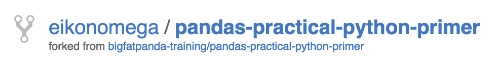
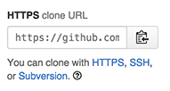

# System Setup
Before we begin, we'll need to get some software onto our machines so that
we can access the class materials, write Python, and test our code.

## Install Git / Creating a GitHub Account
The first thing we need to do is get access to the class materials.  To do this
we'll need to install a program called Git on our computers and create a 
Github account.

Git is, by far, the most popular version control / source control program in
the world today.  Developers use version control systems to efficiently track
changes to project files that occur over time **and** provide a mechanism to 
effectively work with others on the same project.

The class materials as stored in a Git repository that is available online
at Github.  We'll need Git on our systems and a Github account to download the
class materials (and updates to them throughout our course).

If you haven't used Git before - great!  This will be a great introduction and
we'll take it slow.

### Training Steps
1. Download and install the [latest version of Git](https://git-scm.com/downloads).
This will allow you to run Git on your local machine and interact with the
repositories in Github.

    >  Mac users may find they've already
    > got Git installed on their systems via the xCode command lines tools.  To
    > find out, just try to execute `git version` from the command line and see
    > if you got anything back.
    >
    > If you want to use the latest version of Git, go ahead and download it
    > using the link above and then add `/usr/local/git/bin` to your path so that
    > the system uses the latest version instead of the xCode one.
    
2. [Create an account](https://github.com/join) if you don't already have one 
at Github.  The basic account is free and that's all you'll be needing.

## Fork the Class Repo & Clone it to your System
If you're new to Git, you probably just said **WAT!?**  Not a problem.  One
step at a time.

In the world of Github (and services like it) if you want to make a personal
copy of somebody else's project you **fork** it.  This creates a copy of a
project under your account which you can then mess with but the original 
isn't affected.  When you fork a project, Github also remembers the original
repo so that you can "pull" down updates from it.

After you fork the class repo, you'll need to get a copy of it on your local 
machine.  This operation is called "cloning".

Alright?  Let's get started.

### Training Steps

**Fork the Class Repo**

1. Visit the class repo at [https://github.com/bigfatpanda-training/pandas-practical-python-primer](https://github.com/bigfatpanda-training/pandas-practical-python-primer)
2. Click the  button to fork (make a 
copy of) the project in your own Github account.  
3. You should be taken to your copy of the class repo when the process 
completes. **Congratulations!**  The first step is done.  You should see
something like this (but it will have your username instead of eikonomega).

    

**Clone the Repo to your Machine**

1. On your Github repo page (the one you just got to in the previous step), 
you should see something that looks like this:

    
    
2. Make sure that the you've chosen the `HTTPS` link and then copy the 
URL in the dialogue box to your clipboard.  

3. Open a terminal window.  Windows uses should use the 'Git Bash' program
that was installed on your system by the Git installer.  It approximates a
linux terminal.  For Mac users, I highly recommend iTerm2.  Alternatively,
Mac users can also use the built-in Terminal program.

4. Pick a location where you want to clone your fork of the class repo.  
- If you are fairly new to using a terminal, I suggest that you put it in the 
directory that the terminal window places you in.  This will make it easier 
to remember when you put things in later classes.  Either way, make sure 
you write down when you decided to clone the repo.
 
5. Execute the following command to clone the repo: 
`git clone [paste the url you picked up in step 2 here]` 

## Using a Virtual Machine
In the vast majority of circumstances, the Python code that you write will
eventually run on some flavor of Linux.

Because of this (and because debugging Windows issues is enough to drive you
mad) we'll all be using an Ubuntu virtual machine to run the code that you
create and the class examples.

You have a few different choices for how you want to approach this:

1. Use Vagrant to create a local VM.
2. Create a Ubuntu VM in AWS using a personal account.
3. Utilize nitrous.io to create an VM that is accessible via their console.

Each of these methods has positives / negatives and all of them will take a
little bit of time to get setup.
  
The most complex is the using AWS, and if you want to go that route, you'll
probably need a significant amount of previous experience to know how to 
create the instance, connect to it, etc.

Here are some links to further specific instructions for these methods:
* [Class Setup with Vagrant](vagrant.md)
* [Class Setup with Nitrous IO](nitrous.md)

## Installing PyCharm
Using an IDE **can** be very helpful. Particularly for beginners, they
can be immensely time saving - primarily because of the code completion
that they offer.

I strongly suggest that you use the most popular Python IDE, [PyCharm](https://www.jetbrains.com/pycharm/).
That's the tool that I'll be using in class and it's got some great features
that will really help you as your are getting started with Python.

There are multiple editions of the tool offered.  For our class, I suggest
that you download a trial of the professional edition if you didn't receive
a key already.  The open-source version is quite versatile, but it does lack
support for remote interpreters, which we will be using. Don't worry about 
what a remote interpreter is ;)