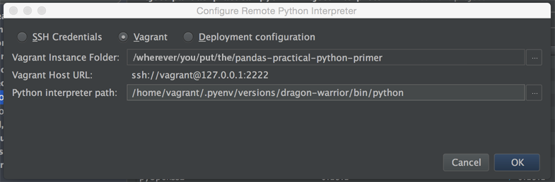
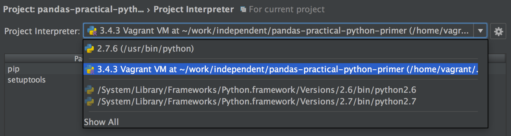
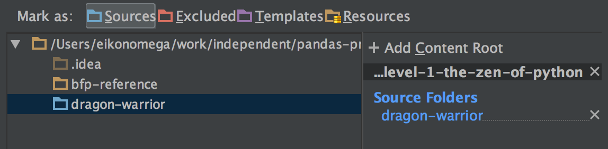

# Level One: The Zen & Basics of Python
In this level, we will be covering Python community standards, and overview
of Object-Oriented programming terminology, basic Python data structures, 
and setting up PyCharm for your projects.

## Class Setup
Prior to each class, you'll want to get the latest materials from my version
of the class repository.  You may also need to rebuild to your virtual machine
if I've made a big change to its structure, or if you powered down your 
machine without suspending it (and therefore hosed it).  Here are the links
to both of those things:
    
- [Grab the latest class updates](../level-0/git-merging-upstream-changes.md)
- [Rebuild the Vagrant VM](../level-0/vagrant-cheatsheet.md)

### PyCharm Project Setup
For each training level of our program, we'll create a new project inside
of PyCharm. To do this, take the following steps:

> Depending on whether you are on a Mac or PC, the names of menu
items can vary slightly.  I work primarily on a Mac, but will note these
differences wherever I am aware of them. 

- Open the class folder as a new project: `File` -> `Open` -> Select `[class-folder]/trainee-area/level...` -> Click `Open/Choose`
    - Make sure that you pick the correct training level.
    - If asked, always choose to open up the project in a new window.
    - You should be presented with an empty editor and a window on the left
    side of the screen showing the files in the directory.
    - If you are presented with a `Unregistered VCS Root Detected` window, you
    can safely ignore it.
    
- We now need to make a couple of changes to the settings so that everything
works correctly.  The first one is a little tricky, the second one is pretty easy.
    - In the `Preferences`(Mac) or `Settings`(Windows) interface, search for
    `Project Interpreter`.  
    - If you haven't setup an interpreter before for class:
        - Click the 
        - Select the `Add Remote` option
        - Fill out the dialogue according to this pattern:      
        
    - If you've already setup an interpreter for class before, just select it
    from the list like so:  
    

- Since there are two code folders in each training level (one for your 
stuff and one for my examples) we need to tell PyCharm to use yours or it
will get confused about how files relate to each other.

- Tell PyCharm where your root source code is for this project so that it will
correctly handle code hinting and imports.  You do this in the `project structure`
area of the settings/preferences.  Make sure to indicate that `trainee-friends-api`
is marked as a `sources` folder.

- Probably restart PyCharm due to software bug in latest version.

## Training Topics
In this training level we are going to be talking about the basic building 
blocks of Python.  We'll approach it using only the minimum necessary 
technospeak.

By the end of the training exercises, you should have a surface level
familiarity for most of the things that you'll see in Python code.

Let's get started!

[Start Training](exercise-1.md)
